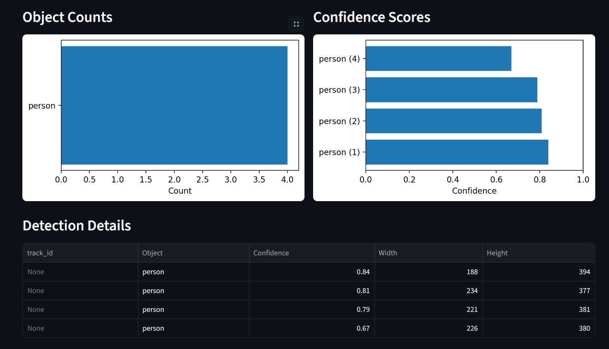
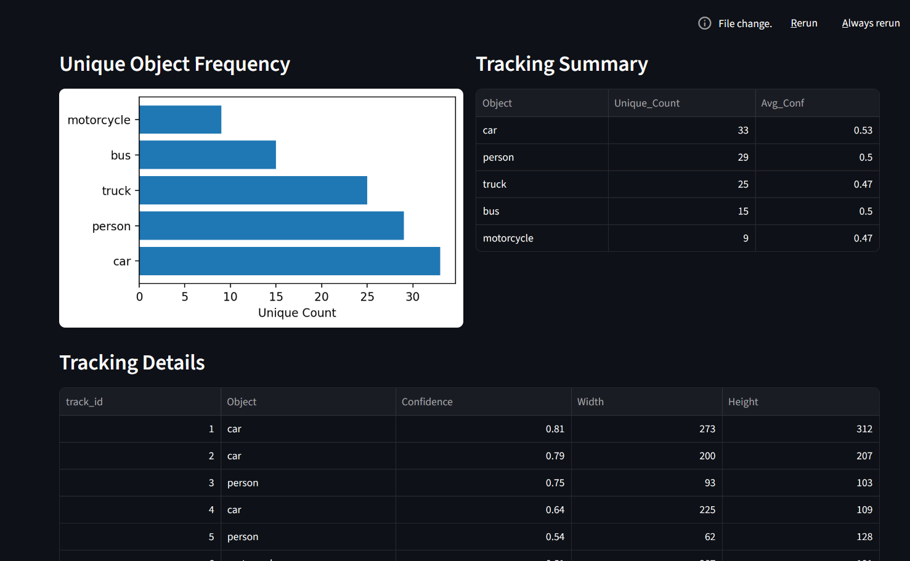

# VisionLens

VisionLens is a computer vision app built with YOLOv8 and Streamlit. It lets you detect and track objects from images, videos, and your webcam.

## <a href="https://visionlens.streamlit.app/" target="_blank">Live Preview</a>

---

## Features

- Image Detection
- Video Object Tracking
- Webcam Detection

## Models

Choose between three YOLOv8 models based on your speed and accuracy needs:

| Model | Speed | Accuracy | Best For |
|-------|-------|----------|----------|
| YOLOv8n | Fastest | Lower | Quick testing |
| YOLOv8s | Balanced | Medium | General use |
| YOLOv8m | Slower | Higher | Better accuracy |

---

## Project Structure

```bash
VISIONLENS/
├── sample_images/
├── sample_videos/
├── ss/
├── venv/
├── app.py
├── vision.ipynb
├── runtime.txt
└── requirements.txt
```

## Installation

Clone the repository:

```bash
git clone https://github.com/atharvmaske/VisionLens.git
```

Move into the project folder:

```bash
cd VisionLens
```

Install dependencies:

```bash
pip install -r requirements.txt
```

Run the app:

```bash
streamlit run app.py
```

---

## How It Works

### Image Detection

Upload an image and VisionLens will detect objects, draw bounding boxes, show confidence scores, and let you download the result.

### Video Tracking

Upload a video and the app will track objects frame by frame, assign unique IDs, and export the annotated video.

### Webcam Detection

Capture a photo from your webcam and run detection instantly on the snapshot.

---

## Screenshots

### Image Detection



### Video Tracking



---

## Built With

- YOLOv8
- Streamlit
- OpenCV
- ByteTrack
